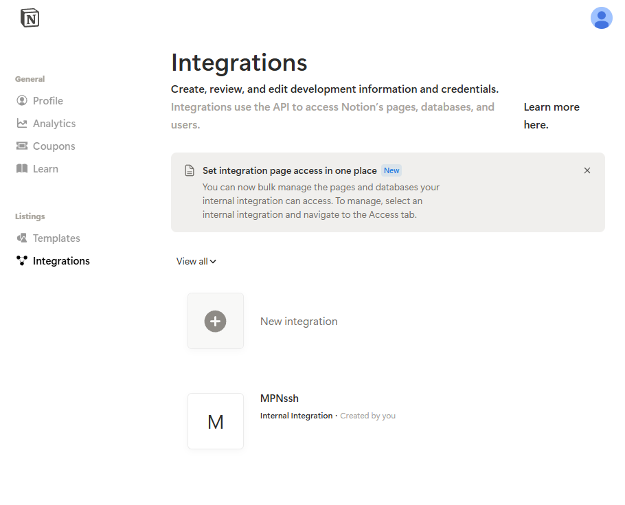
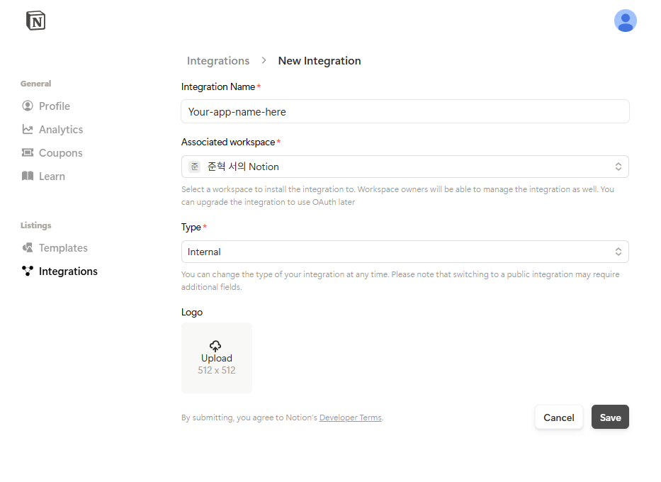
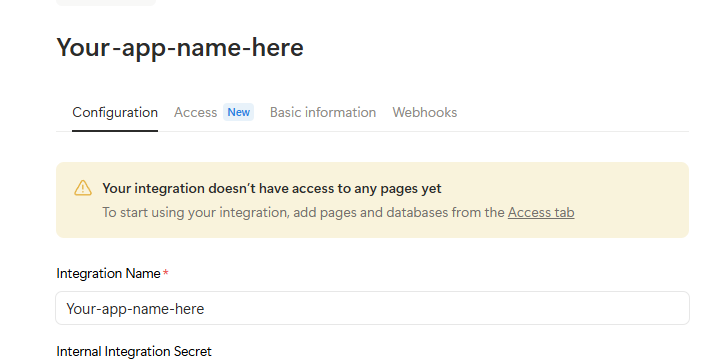
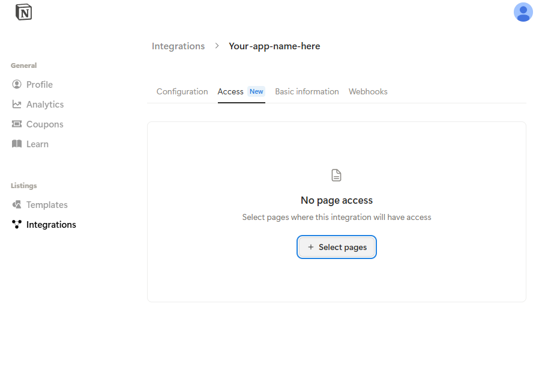
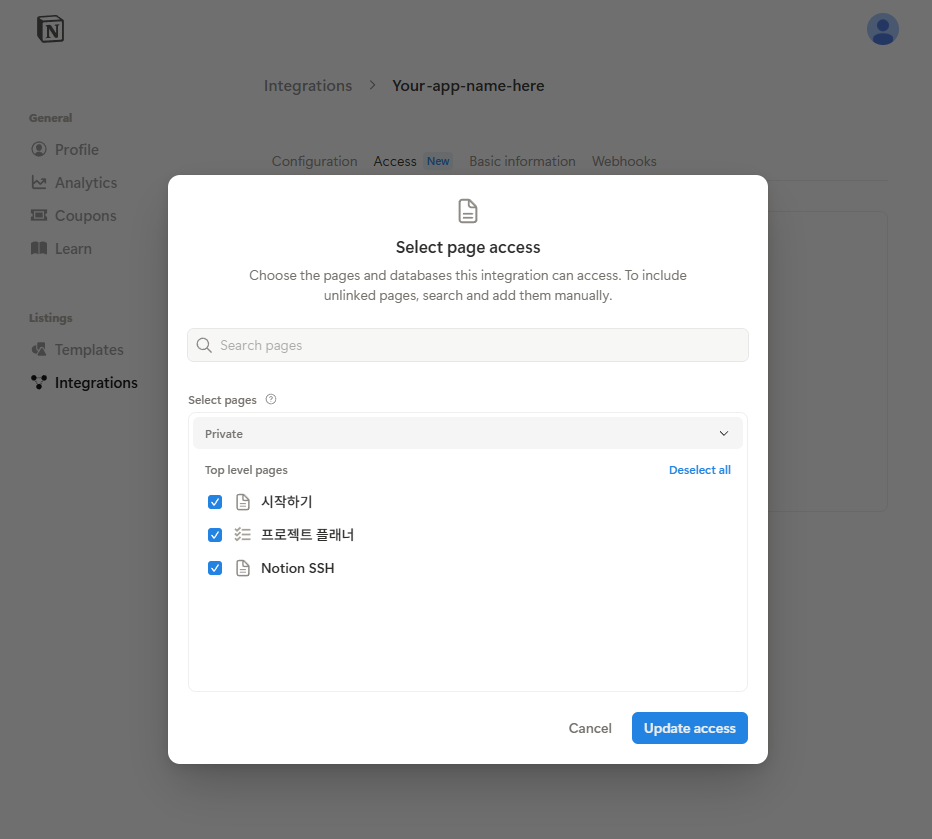

# NotionSSH


## Language / 언어
- [🇰🇷 한국어](README.md)
- [🇺🇸 English](README_en.md)

---

Notion 페이지와 연동되는 원격 명령 실행 도구로, Notion 페이지에 명령어를 작성하면 원격 서버에서 셸 명령어를 실행하고 결과를 실시간으로 확인할 수 있습니다.  

[TMI] :  실제로는 1초 1회 체크입니다 :)


## 개요

NotionSSH는 지정된 Notion 페이지를 모니터링하여 명령 블록을 찾고 호스트 머신에서 실행합니다. `!(명령어)` 형식의 특별한 문법으로 단락이나 할 일 블록에 명령어를 작성하면, 실행 결과가 타임스탬프, 사용자 정보, 머신 상세 정보와 함께 자동으로 페이지에 코드 블럭 형태로 추가됩니다.

## 주요 기능

- **원격 명령 실행**: NotionSSH가 실행 중인 머신에서 셸 명령어 실행 가능
- **크로스 플랫폼 지원**: Windows, Linux, macOS에서 모두 동작
- **실시간 결과 확인**: 명령어 실행 결과가 Notion 페이지에 자동으로 표시
- **사용자 추적**: 누가 언제 어떤 명령어를 실행했는지 기록
- **감사 로깅**: 보안을 위한 로컬 명령어 및 감사 로그 유지
- **중복 실행 방지**: 이미 처리된 명령어의 재실행 방지
- **CA 인증서 검증**: 통신하는 서버가 노션의 서버가 맞는지 검증

## 설치

### 필수 요구사항

- Rust 1.70 이상
- API 접근 권한이 있는 Notion 통합
- 명령어를 실행할 Notion 페이지

### 소스에서 빌드하기

```bash
git clone https://github.com/mirseo/notionSSH
cd notionSSH
cargo build --release
```

실행 파일은 `target/release/notionSSH` (Windows에서는 `notionSSH.exe`)에 생성됩니다.

혹은 Cargo run 으로 바로 실행도 가능합니다. (≧∇≦)  
```bash
git clone https://github.com/mirseo/notionSSH
cd notionSSH
cargo run
```

## 설정

NotionSSH는 두 가지 설정 매개변수가 필요합니다:

1. **Notion API 키**: Notion 통합 토큰
2. **Notion 페이지 URL**: 명령어를 모니터링할 페이지의 URL 
- URL의 경우 (http/https를 포함해서 입력하세요)

### 설정 방법

#### 방법 1: 환경 변수 사용
```bash
export NOTION_API_KEY="secret_xxxxxxxxxxxxx"
export NOTION_PAGE_URL="https://www.notion.so/your-page-id"
```

#### 방법 2: 대화형 설정
환경 변수 없이 프로그램을 실행하면 필요한 정보를 입력하라는 메시지가 표시됩니다:
```bash
./notionSSH
```

설정 정보는 향후 사용을 위해 `.notionSSH/storage.json` 파일에 저장됩니다.  
- 설정 정보를 삭제하려면 `.notionSSH` 폴더를 삭제해주세요
- 이 프로그램은 어떠한 정보도 수집하지 않으며 Notion의 공식 API만 요청합니다.  

### Notion 통합 설정하기

Notion 통합을 생성하고 설정하려면 다음 단계를 따르세요:

#### 1단계: Notion 통합 페이지 접속
1. https://www.notion.so/my-integrations 으로 이동
2. 설정에서 "Integrations" 섹션으로 이동



#### 2단계: 새 통합 생성
1. "+ New integration" 버튼 클릭
2. 통합 세부 정보 입력:
   - **통합 이름**: 통합 이름 입력 (예: "mirseoSSH") <- 사용하고 싶은 이름 사용하세요  
   - **연결된 워크스페이스**: 워크스페이스 선택 <- 누구누구 의 Notion(기본값) 권장
   - **유형**: "Internal"로 유지 <- 보안상 Internal을 권장드립니다! (유사 SSH 수행)  
3. "Save" 클릭하여 통합 생성



#### 3단계: API 키 확인
1. 통합 생성 후 설정 페이지가 표시됩니다
2. "Internal Integration Secret" 복사 <- API 키입니다 (보안 유의!!)
3. 설정에 필요하므로 다른 곳에 잠시 복사해두세요!



#### 4단계: 페이지 접근 권한 설정
1. 통합 설정의 "Access" 탭으로 이동
2. "Select pages"를 클릭하여 통합이 접근할 수 있는 페이지 선택



#### 5단계: 대상 페이지 선택
1. 페이지 선택 대화상자에서 명령어를 실행할 페이지 선택
2. 특정 페이지나 전체 섹션을 선택할 수 있습니다 <- 딱 필요한 페이지만 사용하시는 것을 권장드립니다.  
3. "Update access" 클릭하여 선택 사항 저장



#### 6단계: 페이지 URL 확인
1. 명령어 실행을 위해 선택한 Notion 페이지로 이동
2. 브라우저 주소창에서 URL 복사
3. 이 URL을 NotionSSH 설정에 사용합니다

## 사용법

### 애플리케이션 실행

```bash
./notionSSH
```

애플리케이션이 시작되면 Notion 페이지 모니터링을 시작하고 다음과 같이 표시됩니다:
```
[*] NotionSSH is Loading - waiting for commands. Press Ctrl+C to stop.
```

### 명령어 작성하기

Notion 페이지에서 다음 문법을 사용하여 명령어를 작성합니다:

#### 기본 명령어 문법
명령어는 `!()` 괄호로 둘러싸야 합니다:

```
!(ls -la)
```

```
!(docker ps)
```

```
!(systemctl status nginx)
```

#### 지원하는 블록 유형
명령어는 다음 중 하나에 작성할 수 있습니다:
- **일반 단락 블록**: `!()` 문법으로 명령어 입력
- **할 일 목록 항목**: 체크리스트 항목으로 명령어를 추가하여 더 나은 정리 가능

#### 명령어 예시
일반적인 사용 사례들입니다:  
- 시스템에 설치되었거나 BASH등 환경변수가 설정된 모든 콘솔 변수 및 트리거, 명령을 지원합니다

**시스템 정보:**
```
!(uname -a)
!(df -h)
!(ps aux)
```

**Docker 관리:**
```
!(docker ps)
!(docker images)
!(docker logs container-name)
```

**파일 작업:**
```
!(ls -la /var/log)
!(tail -n 50 /var/log/syslog)
!(find /home -name "*.txt")
```

### 명령어 실행 결과

명령어가 실행되면 NotionSSH가 자동으로 다음 내용을 포함한 코드 블록을 추가합니다:

```
$ your-command
[명령어 출력 결과]
---
executed_by=user@example.com | node=hostname | 2025-01-15T10:30:45Z
# notionSSH-executed
```

이후 다음 정보를 보여주는 메타데이터 단락이 추가됩니다:
- **사용자 이메일**: 명령어를 실행한 사용자
- **머신 이름**: 명령어를 실행한 서버
- **타임스탬프**: 명령어가 실행된 시간
- **실행 마커**: 동일한 명령어의 재실행 방지

## 로깅

NotionSSH는 두 가지 유형의 로그를 유지합니다:

### 명령어 로그
- 위치: `./logs/command.YYYYMMDD.log`
- 형식: `[YYYY-MM-DD:HH:MM:NNNNN] {user@email.com} : command`
- 실행된 모든 명령어의 타임스탬프 기록 포함

### 감사 로그
- 위치: `./log` (단일 파일)
- 형식: `command , requester , iso_timestamp , node_name , status`
- 규정 준수 및 보안 모니터링을 위한 CSV 형식 감사 추적

## 보안 고려사항

- **접근 제어**: Notion 페이지에 편집 권한이 있는 사용자만 명령어 실행 가능
- **명령어 로깅**: 모든 명령어가 사용자 정보와 함께 로그에 기록
- **인증 없음**: 도구는 Notion의 사용자 관리를 신뢰
- **셸 접근**: 명령어는 NotionSSH 프로세스와 동일한 권한으로 실행

## 아키텍처

### 핵심 구성 요소

- **config.rs**: 설정 로딩 및 검증 처리
- **notion.rs**: Notion API 클라이언트 및 페이지 상호작용
- **parser.rs**: Notion 블록에서 명령어 파싱
- **executor.rs**: 크로스 플랫폼 명령어 실행
- **logger.rs**: 감사 및 명령어 로깅
- **util.rs**: URL 파싱 및 시스템 정보를 위한 유틸리티 함수
- **verify.rs**: CA 인증서 파싱 및 보안을 위한 인증 함수

### 명령어 처리 흐름

1. `!(명령어)` 패턴을 포함한 새 블록에 대한 Notion 페이지 모니터링
2. 명령어 파싱 및 기존 실행 마커 확인
3. 플랫폼에 적합한 셸을 사용하여 명령어 실행
4. 출력 및 실행 메타데이터 수집
5. Notion 페이지에 결과 추가
6. 감사 목적으로 명령어 실행 기록

## 플랫폼 지원

### Windows
- 명령어 실행에 `cmd /C` 사용
- 노드 식별을 위해 `COMPUTERNAME` 환경 변수 읽기

### Linux/Unix/macOS
- `$SHELL`, `bash`, `sh` 순서로 실행 시도
- 노드 식별을 위해 `hostname` 명령어 사용
- `HOSTNAME` 환경 변수 지원

## 개발

### 테스트 실행
```bash
cargo test
```

### 릴리스 빌드
```bash
cargo build --release
```

### 코드 구조
- `src/lib.rs`: 메인 애플리케이션 루프 및 오케스트레이션
- `src/main.rs`: 진입점
- 개별 모듈이 특정 책임 처리 (설정, notion API, 파싱 등)

## 문제 해결

### 일반적인 문제

**"Failed to fetch children" 오류**
- Notion API 키가 올바른지 확인
- 통합이 대상 페이지에 접근 권한이 있는지 확인
- 페이지 URL이 유효한지 확인

**명령어가 실행되지 않는 경우**
- 명령어 문법이 `!(명령어)` 형식을 사용하는지 확인
- 명령어가 이미 실행되지 않았는지 확인 (실행 마커 확인)
- NotionSSH가 적절한 시스템 권한을 가지고 있는지 확인

**권한 거부 오류**
- 실행하려는 명령어에 적절한 권한으로 NotionSSH 실행
- 로그 출력을 위한 파일/디렉터리 권한 확인

## 기여

이 프로젝트는 Rust로 작성되었으며 표준 Rust 개발 관행을 사용합니다. 기여할 때는 테스트를 포함하고 기존 코드 스타일을 유지해주세요.

## 라이센스

이 프로젝트는 MIT 라이센스를 따릅니다.  
자유로운 수정, 재배포, 2차 창작을 포함한 라이센스 전역을 허용합니다.

