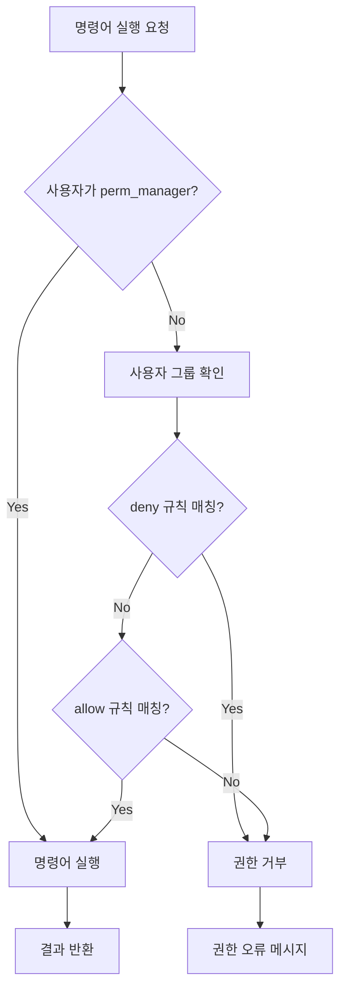

# 사용자 접근 제어 (Access Control)

## Language / 언어
- [🇰🇷 한국어](access.md)
- [🇺🇸 English](access_en.md)

---

NotionSSH는 세부적인 사용자 접근 제어를 지원합니다. 특정 사용자가 실행할 수 있는 명령어를 제한하고, 관리자와 일반 사용자를 구분할 수 있습니다.

## 접근 제어 파일 구조

접근 제어 설정은 `.notionSSH/access.json` 파일에 저장됩니다. NotionSSH를 처음 실행하면 기본 설정이 자동으로 생성됩니다.

### 기본 설정 파일 예시
```json
{
  "emails": {
    "user@example.com": "restricted_user",
    "admin@example.com": "power_user"
  },
  "perm_manager": [
    "manager@example.com",
    "super@example.com"
  ],
  "perms": {
    "default": {
      "allow": ["*"],
      "deny": []
    },
    "restricted_user": {
      "allow": ["ls", "pwd", "whoami", "date"],
      "deny": ["rm", "sudo", "su"]
    },
    "power_user": {
      "allow": ["*"],
      "deny": ["rm -rf", "sudo rm"]
    }
  }
}
```

## 설정 구성 요소

### 1. emails
특정 사용자 이메일을 권한 그룹(role)에 매핑합니다.
- **키**: 사용자 이메일 주소
- **값**: 권한 그룹 이름 (perms에 정의된 그룹)
- 설정되지 않은 사용자는 자동으로 "default" 그룹에 할당됩니다

### 2. perm_manager
관리자 목록입니다. 여기에 등록된 사용자는 모든 명령어를 실행할 수 있습니다.
- 권한 검사를 우회하며 항상 모든 명령어 실행 가능
- 보안상 중요한 역할이므로 신중히 설정하세요

### 3. perms
권한 그룹별 규칙을 정의합니다.
- **그룹명**: 권한 그룹의 이름 (emails에서 참조)
- **allow**: 허용된 명령어 목록
- **deny**: 금지된 명령어 목록 (allow보다 우선순위가 높음)

## 명령어 매칭 규칙

### 와일드카드 매칭
- `"*"`: 모든 명령어 허용

### 단일 명령어 매칭
```json
{
  "allow": ["ls", "pwd", "date"]
}
```
명령어의 첫 번째 토큰만 비교합니다 (대소문자 무시):
- `!(ls -la)` → `ls` 매칭 ✓
- `!(pwd)` → `pwd` 매칭 ✓

### 명령어 전체 매칭
```json
{
  "deny": ["rm -rf", "sudo rm"]
}
```
공백이 포함된 경우 명령어 전체와 접두사 매칭:
- `!(rm -rf /tmp)` → `rm -rf` 매칭 ✓
- `!(sudo rm file.txt)` → `sudo rm` 매칭 ✓

## 권한 처리 우선순위

1. **관리자 검사**: `perm_manager`에 등록된 사용자는 모든 명령어 실행 가능
2. **사용자 그룹 결정**: `emails`에서 사용자 그룹 확인 (없으면 "default")
3. **거부 규칙 검사**: `deny` 목록에서 명령어 차단 여부 확인
4. **허용 규칙 검사**: `allow` 목록에서 명령어 허용 여부 확인
5. **기본 거부**: 명시적으로 허용되지 않은 명령어는 거부

## 설정 예시

### 예시 1: 기본적으로 모든 명령어 허용, 특정 명령어만 차단
```json
{
  "emails": {},
  "perm_manager": ["admin@company.com"],
  "perms": {
    "default": {
      "allow": ["*"],
      "deny": ["rm -rf", "sudo", "su", "passwd"]
    }
  }
}
```

### 예시 2: 기본적으로 제한적, 특정 사용자에게 추가 권한 부여
```json
{
  "emails": {
    "devops@company.com": "devops_user",
    "intern@company.com": "readonly_user"
  },
  "perm_manager": ["admin@company.com"],
  "perms": {
    "default": {
      "allow": ["ls", "pwd", "whoami", "date", "ps"],
      "deny": []
    },
    "devops_user": {
      "allow": ["*"],
      "deny": ["rm -rf /"]
    },
    "readonly_user": {
      "allow": ["ls", "pwd", "whoami", "date"],
      "deny": ["*"]
    }
  }
}
```

### 예시 3: 부서별 권한 관리
```json
{
  "emails": {
    "dev1@company.com": "developer",
    "dev2@company.com": "developer", 
    "ops1@company.com": "operation",
    "ops2@company.com": "operation",
    "junior@company.com": "trainee"
  },
  "perm_manager": ["cto@company.com", "devops-lead@company.com"],
  "perms": {
    "default": {
      "allow": ["ls", "pwd", "whoami", "date"],
      "deny": []
    },
    "developer": {
      "allow": ["ls", "pwd", "whoami", "date", "ps", "git", "npm", "node", "python", "docker ps"],
      "deny": ["sudo", "rm -rf", "chmod", "chown"]
    },
    "operation": {
      "allow": ["*"],
      "deny": ["rm -rf /", "sudo shutdown", "sudo reboot"]
    },
    "trainee": {
      "allow": ["ls", "pwd", "whoami", "date", "echo"],
      "deny": ["*"]
    }
  }
}
```

## 접근 제어 적용하기

### 1단계: 설정 파일 수정
`.notionSSH/access.json` 파일을 원하는 설정으로 편집합니다.

### 2단계: 설정 검증
NotionSSH 재시작 시 설정 파일이 자동으로 검증됩니다. 문법 오류가 있으면 시작 시 오류 메시지가 표시됩니다.

### 3단계: 권한 테스트
- 제한된 사용자로 명령어를 실행해보고 권한이 올바르게 적용되는지 확인
- 권한이 없는 명령어 실행 시 "명령어를 실행할 권한이 부족합니다" 메시지가 표시됩니다

## 보안 권장사항

### 최소 권한 원칙
- 사용자에게 업무 수행에 필요한 최소한의 권한만 부여
- `perm_manager`에는 꼭 필요한 관리자만 등록
- 기본 설정(`default`)을 제한적으로 설정

### 정기적인 권한 검토
- 주기적으로 사용자 권한을 검토하고 불필요한 권한 제거
- 퇴사자 계정은 즉시 `access.json`에서 제거
- 감사 로그를 통해 권한 사용 현황 모니터링

### 위험한 명령어 차단
다음과 같은 위험한 명령어는 `deny` 목록에 추가하는 것을 권장합니다:
- `rm -rf`
- `sudo shutdown`
- `sudo reboot` 
- `passwd`
- `su`
- `chmod 777`
- `chown -R`

## 문제 해결

### 설정 파일이 손상된 경우
- `.notionSSH/access.json` 파일을 삭제하면 다음 실행 시 기본 설정으로 재생성됩니다
- 백업 파일이 있다면 복원 후 사용

### 권한이 적용되지 않는 경우
- 사용자가 `perm_manager`에 등록되어 있는지 확인 (관리자는 모든 권한 보유)
- 이메일 주소가 정확한지 확인 (대소문자는 무시하지만 정확한 주소 필요)
- JSON 문법이 올바른지 확인 (trailing comma, 따옴표 등)

### 일반적인 오류 메시지

#### "access.json missing required 'perms.default' rule"
- `perms` 객체에 반드시 "default" 그룹이 정의되어 있어야 합니다

#### "access.json is empty"
- 설정 파일이 비어있거나 공백만 있는 경우 발생
- 파일을 삭제하고 재생성하거나 올바른 JSON 구조로 수정

#### JSON 파싱 오류
- JSON 문법 오류 시 발생하는 메시지들
- 온라인 JSON 검증 도구를 사용하여 문법 확인

## 명령어 실행 플로우

