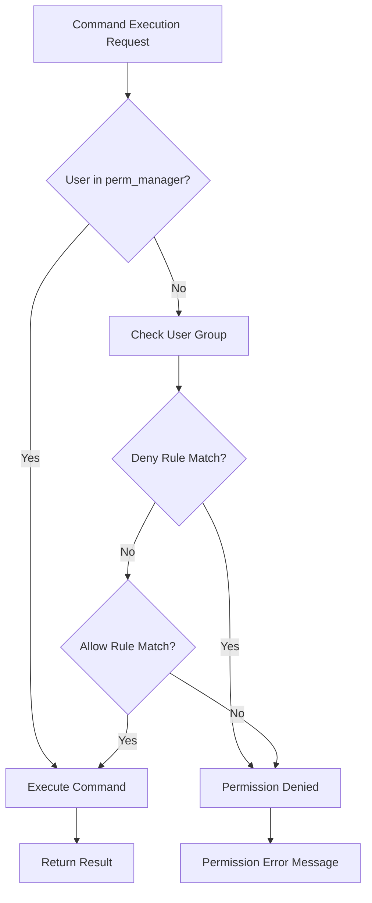

# User Access Control

## Language / 언어
- [🇰🇷 한국어](access.md)
- [🇺🇸 English](access_en.md)

---

NotionSSH supports fine-grained user access control. You can restrict which commands specific users can execute and distinguish between administrators and regular users.

## Access Control File Structure

Access control settings are stored in the `.notionSSH/access.json` file. When you run NotionSSH for the first time, default settings are automatically created.

### Default Configuration File Example
```json
{
  "emails": {
    "user@example.com": "restricted_user",
    "admin@example.com": "power_user"
  },
  "perm_manager": [
    "manager@example.com",
    "super@example.com"
  ],
  "perms": {
    "default": {
      "allow": ["*"],
      "deny": []
    },
    "restricted_user": {
      "allow": ["ls", "pwd", "whoami", "date"],
      "deny": ["rm", "sudo", "su"]
    },
    "power_user": {
      "allow": ["*"],
      "deny": ["rm -rf", "sudo rm"]
    }
  }
}
```

## Configuration Components

### 1. emails
Maps specific user emails to permission groups (roles).
- **Key**: User email address
- **Value**: Permission group name (defined in perms)
- Users not configured here are automatically assigned to the "default" group

### 2. perm_manager
List of administrators. Users registered here can execute all commands.
- Bypasses permission checks and can always execute all commands
- This is a security-critical role, so configure it carefully

### 3. perms
Defines rules for each permission group.
- **Group name**: Name of the permission group (referenced from emails)
- **allow**: List of allowed commands
- **deny**: List of forbidden commands (higher priority than allow)

## Command Matching Rules

### Wildcard Matching
- `"*"`: Allows all commands

### Single Command Matching
```json
{
  "allow": ["ls", "pwd", "date"]
}
```
Compares only the first token of the command (case-insensitive):
- `!(ls -la)` → matches `ls` ✓
- `!(pwd)` → matches `pwd` ✓

### Full Command Matching
```json
{
  "deny": ["rm -rf", "sudo rm"]
}
```
When spaces are included, matches against the entire command as a prefix:
- `!(rm -rf /tmp)` → matches `rm -rf` ✓
- `!(sudo rm file.txt)` → matches `sudo rm` ✓

## Permission Processing Priority

1. **Administrator Check**: Users in `perm_manager` can execute all commands
2. **User Group Determination**: Check user group from `emails` (defaults to "default")
3. **Deny Rule Check**: Check if command is blocked by `deny` list
4. **Allow Rule Check**: Check if command is permitted by `allow` list
5. **Default Deny**: Commands not explicitly allowed are denied

## Configuration Examples

### Example 1: Allow all commands by default, block specific commands
```json
{
  "emails": {},
  "perm_manager": ["admin@company.com"],
  "perms": {
    "default": {
      "allow": ["*"],
      "deny": ["rm -rf", "sudo", "su", "passwd"]
    }
  }
}
```

### Example 2: Restrictive by default, grant additional permissions to specific users
```json
{
  "emails": {
    "devops@company.com": "devops_user",
    "intern@company.com": "readonly_user"
  },
  "perm_manager": ["admin@company.com"],
  "perms": {
    "default": {
      "allow": ["ls", "pwd", "whoami", "date", "ps"],
      "deny": []
    },
    "devops_user": {
      "allow": ["*"],
      "deny": ["rm -rf /"]
    },
    "readonly_user": {
      "allow": ["ls", "pwd", "whoami", "date"],
      "deny": ["*"]
    }
  }
}
```

### Example 3: Department-based Permission Management
```json
{
  "emails": {
    "dev1@company.com": "developer",
    "dev2@company.com": "developer", 
    "ops1@company.com": "operation",
    "ops2@company.com": "operation",
    "junior@company.com": "trainee"
  },
  "perm_manager": ["cto@company.com", "devops-lead@company.com"],
  "perms": {
    "default": {
      "allow": ["ls", "pwd", "whoami", "date"],
      "deny": []
    },
    "developer": {
      "allow": ["ls", "pwd", "whoami", "date", "ps", "git", "npm", "node", "python", "docker ps"],
      "deny": ["sudo", "rm -rf", "chmod", "chown"]
    },
    "operation": {
      "allow": ["*"],
      "deny": ["rm -rf /", "sudo shutdown", "sudo reboot"]
    },
    "trainee": {
      "allow": ["ls", "pwd", "whoami", "date", "echo"],
      "deny": ["*"]
    }
  }
}
```

## Applying Access Control

### Step 1: Modify Configuration File
Edit the `.notionSSH/access.json` file with your desired settings.

### Step 2: Configuration Validation
The configuration file is automatically validated when NotionSSH restarts. If there are syntax errors, an error message will be displayed at startup.

### Step 3: Test Permissions
- Try executing commands as a restricted user to verify permissions are correctly applied
- When executing commands without permission, the message "permission denied to execute the command" will be displayed

## Security Recommendations

### Principle of Least Privilege
- Grant users only the minimum permissions necessary for their work
- Register only essential administrators in `perm_manager`
- Configure the default setting (`default`) restrictively

### Regular Permission Reviews
- Periodically review user permissions and remove unnecessary permissions
- Remove departing employee accounts from `access.json` immediately
- Monitor permission usage through audit logs

### Block Dangerous Commands
It's recommended to add the following dangerous commands to the `deny` list:
- `rm -rf`
- `sudo shutdown`
- `sudo reboot` 
- `passwd`
- `su`
- `chmod 777`
- `chown -R`

## Troubleshooting

### When Configuration File is Corrupted
- Delete the `.notionSSH/access.json` file and it will be regenerated with default settings on the next run
- If you have a backup file, restore it and use it

### When Permissions Are Not Applied
- Check if the user is registered in `perm_manager` (administrators have all permissions)
- Verify the email address is correct (case is ignored but the exact address is required)
- Check JSON syntax is correct (trailing commas, quotes, etc.)

### Common Error Messages

#### "access.json missing required 'perms.default' rule"
- The `perms` object must have a "default" group defined

#### "access.json is empty"
- Occurs when the configuration file is empty or contains only whitespace
- Delete the file and regenerate it, or fix it with the correct JSON structure

#### JSON Parsing Errors
- Messages that occur when there are JSON syntax errors
- Use online JSON validation tools to check syntax

## Command Execution Flow



This access control system allows you to operate NotionSSH safely and efficiently.